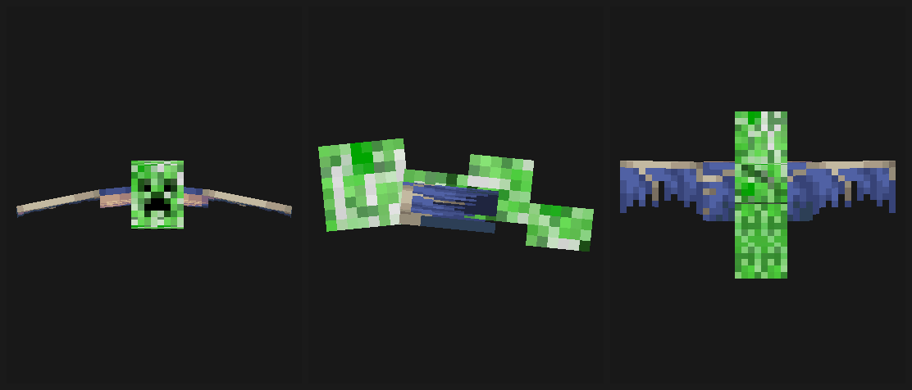

# 杂交苦力怕 Hybrid Creeper

> Minecraft **1.21.1** · **NeoForge** · MIT · v1.3.0

给游戏加入 **两只会上门索命的爆炸系敌对生物**。原版内容一个字节都不改。
两者都能像原版苦力怕一样**被闪电充能**，爆炸威力翻倍。



<sub>苦力怕幻翼的模型预览（左：正面 / 中：侧面 / 右：俯视）。软件渲染出的模型图，不是游戏内截图。</sub>

---

## 安装

| 要求 | 版本 |
| --- | --- |
| Minecraft | **1.21.1** |
| NeoForge | **21.1.172** 或更高（21.1.x 系列任意版本都可以） |
| Java | 21 |
| 多人服务器 | **客户端也必须安装**（见[注意事项](#注意事项)） |

1. 装好 NeoForge 1.21.1 的客户端 / 服务端；
2. 把 `hybridcreeper-1.1.1.jar` 放进 `mods/` 文件夹；
3. 启动游戏。

首次进入世界后会自动生成配置文件 `config/hybridcreeper-common.toml`。

> **卸载**：删掉 jar 就行，原版内容没有任何痕迹。地图里已经刷出来的两只生物会变成「未知实体」并消失，属正常现象。

---

## 生物一 · 苦力怕幻翼

> `hybridcreeper:creeperphantom` ・ Creeper Phantom

一只**会俯冲自爆**的幻翼。

它和原版幻翼几乎一样：相同的血量（20）、攻击力、跟随范围、命中箱、叫声，一样怕猫、会被阳光点燃、在和平模式消失。**掉落物比原版多一样** —— 除了幻翼膜，还掉**火药**（0~2 个，受抢夺加成）。

**生成机制是完全独立的**：它不伴随原版幻翼、也不看玩家睡没睡觉 —— 而是像僵尸那样走**标准怪物刷新循环**（夜晚或阴暗处、主世界地表生成后起飞）。所以你熬不熬夜都会遇到它；反过来，**原版幻翼该怎么来还是怎么来**（它仍然只在玩家连续 3 个游戏日没睡觉之后才出现，那是原版自己的规则，本模组不干预）。

**唯一的区别在它咬中你的那一瞬间。**

|  | 原版幻翼 | 苦力怕幻翼 |
| --- | --- | --- |
| 俯冲击中玩家 | 撕咬伤害 | 撕咬伤害 **＋ 苦力怕等级爆炸** |
| ⚡ 闪电充能 | 不适用 | 被雷劈中后**爆炸半径翻倍**（3.0 → 6.0），见[闪电充能](#-闪电充能) |

> ### ⚠️ 默认参数下必死
>
> 被咬中会同时吃到 `撕咬伤害（6 + 体型）` **和** `近距离爆炸伤害（约 49 点）`。
> 穿钻石套也基本活不下来。
>
> 觉得太狠，把 `hitPlayerDamageMultiplier` 调到 `0.4` 左右 —— 见[配置](#配置)。

**原版幻翼完全不受影响。** 它依然是原版的行为、模型与生成方式，两只生物可以共存于同一个世界。

### 怎么把它叫出来

```
/summon hybridcreeper:creeperphantom ~ ~10 ~
```

创造模式的「刷怪蛋」标签页里也有 **苦力怕幻翼刷怪蛋**。

想立刻被咬到：`/time set midnight`，站到开阔地等它盘旋几轮 —— 它会先嘶吼一声，然后俯冲。

---

## 生物二 · 苦力怕海豚

> `hybridcreeper:water_creeper` ・ Creeper Dolphin

一只专门在水里猎杀玩家的生物。

| 特性 | 说明 |
| --- | --- |
| **出现地点** | **任何有水的地方** —— 海洋、河流、湖泊、池塘、沼泽乃至 **1 格深的小水坑**，**任何时段**（不看光照，白天也刷） |
| **生成概率** | `water_creature` 刷新池（与墨鱼、海豚共池，**上限 5**）；在非海洋/河流群系中该池只有它，所以水坑合格即必刷 |
| **游动速度** | **很快** —— 在水里光靠游泳是甩不掉它的（想拉开距离得靠船） |
| **撞击船** | 高速撞向船上的你，造成伤害并把船撞偏，打断你的行动 |
| **膨胀自爆** | 贴身后开始膨胀，约 1.5 秒后爆炸（机制与苦力怕相同） |
| **上岸追击** | 你躲到岸边，它会**跳出水面扑上来**，落地立即引爆 |
| **⚡ 闪电充能** | 被雷劈中后爆炸半径翻倍（3.0 → 6.0）—— 见[闪电充能](#-闪电充能) |

### 怎么对付它

**往高处跑。** 它的跳跃高度有限（约 1.5 格），站在悬崖或有落差的高岸上就是安全的。

### 怎么把它叫出来

```
/summon hybridcreeper:water_creeper ~ ~ ~
```

创造模式的「刷怪蛋」标签页里也有 **苦力怕海豚刷怪蛋**。

想现场看效果：找一片海 → `/time set midnight` → 划船在水面飘着（它会撞船）→ 跳下水（它会膨胀）→ 逃上岸（它会扑上来）。

---

## ⚡ 闪电充能

**上面两只生物都能像原版苦力怕那样，被闪电劈成「充能」状态。** 机制完全照搬原版：

| | 普通 | 闪电充能 |
| --- | --- | --- |
| 爆炸半径 | `3.0` | **`6.0`**（翻倍） |

被劈中后会裹上一层**滚动的蓝色能量**（就是充能苦力怕身上那层），大老远就能认出来。

**充能是永久的** —— 劈过一次就一直是充能状态，淋雨、泡水、睡觉都不会掉。原版苦力怕也是这个规矩。

### 什么闪电都算

不需要额外操作，游戏里任何来源的闪电都生效：

- 雷雨天自然落雷劈中它们；
- **引雷（Channeling）附魔的三叉戟**掷中它们（投掷时需要下雨）；
- 指令：`/summon lightning_bolt ~ ~ ~`

> 苦力怕海豚**在水里也能被劈中** —— 原版闪电的判定不做水中过滤。
> 但它身上的火会立刻被水浇灭，所以实际只剩下「充能 + 雷电伤害」。

### 想自己验证一下

```
/summon hybridcreeper:creeperphantom ~ ~10 ~
/data get entity @e[type=hybridcreeper:creeperphantom,limit=1] powered
/summon lightning_bolt ~ ~10 ~
/data get entity @e[type=hybridcreeper:creeperphantom,limit=1] powered
```

第二条命令会返回「找不到 `powered`」—— **没被劈过的生物，NBT 里根本没有这个键**（原版苦力怕就是这么省字节的：只在为真时才写）。劈完再执行最后一条，会变成 `1b`。

> ⚠️ **充能后威力 6.0，在 `destroyBlocks = true` 下一次能炸掉一栋木屋。**
> 测试时建议先把 `destroyBlocks` 改成 `false`，免得把家炸了。

---

## 配置

文件：`config/hybridcreeper-common.toml`，首次启动游戏时自动生成。

### 常用改法

| 想要的效果 | 改哪一项 |
| --- | --- |
| 保护建筑，只炸人不炸地形 | `destroyBlocks = false` |
| 太致命了，想能活下来 | `hitPlayerDamageMultiplier = 0.4` |
| 只惩罚周围的怪，不额外伤害被咬的人 | `hitPlayerDamageMultiplier = 0.0` |
| 更猛一点，像 TNT | `explosionPower = 4.0` |
| 自爆后同归于尽 | `phantomImmune = false` |
| 关掉爆炸，只保留生物 | `enabled = false` |
| 压根不想让它自然刷出来 | `naturalSpawn = false` |
| 只让玩家用指令召唤，不自然刷出来 | `[spawn] naturalSpawn = false` |
| 看不出到底有没有触发 | `debugLog = true`，日志里会打坐标 |
| **海豚别自爆，只撞船** | `[waterCreeper] explode = false` |
| **海豚在水里太快 / 太慢** | `[waterCreeper.attributes] swimSpeed`（默认 7.5） |
| **海豚别跳上岸扑人** | `[waterCreeper.ai] beachAssault = false` |
| **给海豚更多逃跑时间** | `[waterCreeper.explosion] fuseTicks = 60`（3 秒） |
| **一只海豚都别刷** | `[waterCreeper] naturalSpawn = false` |

### 全部选项

```toml
[general]
    # 总开关。false 时苦力怕幻翼只俯冲撕咬，不爆炸。
    # 注意：这个开关不影响原版幻翼 —— 它从头到尾都没被改过。
    enabled = true

[explosion]
    # 爆炸威力。原版苦力怕 = 3.0，TNT = 4.0，凋灵生成时 = 7.0。
    explosionPower = 3.0
    # 是否破坏方块。true = 苦力怕级（受 mobGriefing 约束）；false = 只炸实体，地形完好。
    destroyBlocks = true
    # 爆炸是否引燃周围方块。原版苦力怕不引燃。
    setFire = false
    # 苦力怕幻翼是否免疫自己引发的爆炸。
    phantomImmune = true

[damage]
    # 爆炸对所有实体的伤害倍率。
    damageMultiplier = 1.0
    # 额外作用于「被咬中的那名玩家」的伤害倍率。
    hitPlayerDamageMultiplier = 1.0
    # 同一只生物两次引爆的最小间隔（tick，20 tick = 1 秒）。
    cooldownTicks = 40

[spawn]
    naturalSpawn = true              # 是否参与自然生成（false = 只能 /summon 或刷怪蛋）
                                     # 生成条件：夜晚/阴暗处 + 主世界地表，与僵尸同款
                                     # 密度由数据包 creeper_phantom_spawns.json 的 weight 控制（默认 20）

[debug]
    debugLog = false

[waterCreeper]
    # 是否自爆。false = 只撞船与近战撕咬，不再引爆自己。
    explode = true
    # 是否参与自然生成。false = 只能靠指令或刷怪蛋。
    naturalSpawn = true

    [waterCreeper.attributes]
        maxHealth = 20.0             # 最大生命
        attackDamage = 4.0           # 撞击伤害（爆炸另算）
        movementSpeed = 1.5          # 陆地上（含上岸突袭）的移速
        swimSpeed = 7.5              # 水中的速度倍率（水里速度 = 0.02 × 本值）
        followRange = 32.0           # 主动索敌距离
        knockbackResistance = 0.3    # 抗击退

    [waterCreeper.explosion]
        explosionPower = 3.0         # 爆炸威力（= 半径）
        destroyBlocks = true         # 是否破坏方块
        setFire = false              # 是否引燃
        damageMultiplier = 1.0       # 爆炸伤害倍率
        fuseTicks = 30               # 引信长度（20 tick = 1 秒）
        chargedMultiplier = 2.0      # 被闪电充能后的半径倍率

    [waterCreeper.ai]
        swellRange = 3.0             # 贴到几格内开始点燃引信
        beachAssault = true          # 是否允许跳出水面扑上岸

    [waterCreeper.ram]
        cooldownTicks = 16           # 两次撞船之间的最小间隔
```

> ### 两只生物的参数是**分开**的
>
> - `[general]` / `[explosion]` / `[damage]` / `[spawn]` 那几段**只作用于苦力怕幻翼**。
> - **苦力怕海豚的全部参数在 `[waterCreeper]` 段**（共 17 项，见上）。
>
> ⚠️ 配置里的数值是在生物**生成时**写进它的属性与实体 NBT 的
> （与苦力怕一样，`Fuse` / `ExplosionRadius` 都存在 NBT 里）。所以：
> **改完配置后新刷出的生物立刻生效**；已经存在于世界里的旧生物保留它们自己的数值，
> 等它们消失或重新刷出后生效。想单独改某一只：
> `/data merge entity <目标> {Fuse:60,ExplosionRadius:5}`。
>
> 💡 想确认配置到底有没有生效：`[debug] debugLog = true` 后，
> 用 `/summon hybridcreeper:water_creeper ~ ~ ~` 刷一只新的来看。

---

## 注意事项

- **多人服务器必须让客户端也安装** —— 本模组有自定义模型与自定义实体，客户端不装会连不上服务器。
- **创造模式不会触发爆炸** —— 原版对创造模式玩家本来就不结算伤害。
- **举盾完全格挡时不爆炸** —— 伤害被盾牌压成 0，判定为「没咬中」。
- **下界与末地不会自然生成** —— 生物群系修饰符只作用于主世界（`#minecraft:is_overworld`）。
- **苦力怕海豚已有专属模型与贴图**（海豚身 + 苦力怕的躯干/头/四条腿），不再借用原版海豚；命中箱沿用 0.9 × 0.6。
- **原版内容零改动** —— 本模组只是新增内容，没有修改任何原版生物、物品或生成规则。与其他模组几乎不会冲突。

---

## 许可证

**MIT** —— 全文见 [LICENSE](LICENSE)。

完整改动记录见 [CHANGELOG.md](CHANGELOG.md)；各版本的下载见 [Releases](https://github.com/q769429109-gif/creeper-phantom/releases)。
